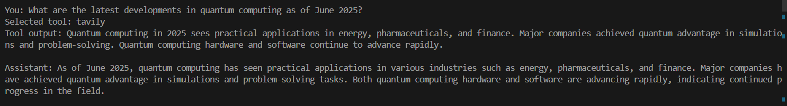
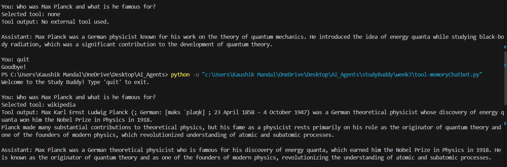
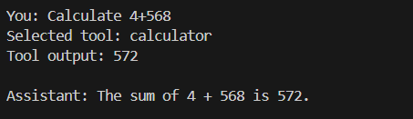
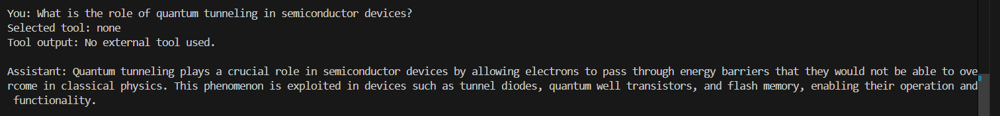
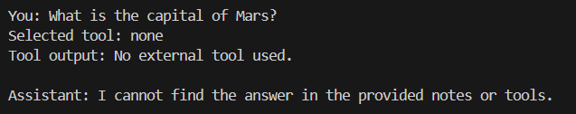
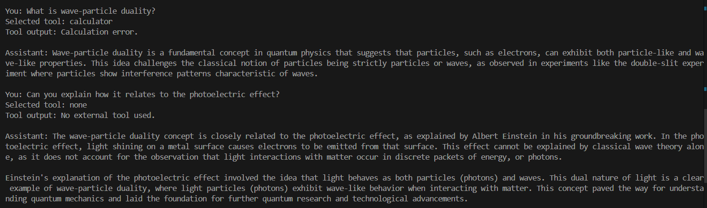

### To run the code follow the same setup as week 2 README.md  

Check out the [Week 2 README here](../week2/README.md).

- In addition, set your `TAVILY_API_KEY` in a `.env` file in the root folder.

> TAVILY_API_KEY= "******************************"

# Testing using various test cases

### 1. Tool Use: Tavily Search (Web Search API)
Q. What are the latest developments in quantum computing as of June 2025?

### 2. Tool Use: Wikipedia (Factual Summary)

Q. Who was Max Planck and what is he famous for?

You can see that when the first time I didnt added who was for the tool selector keyword(thats why showing Selected tool: none), the response was not rich, and the 2nd response is more rich because of using wikipedia

### 3. Tool Use: Calculator

Q. Calculate 4+568

### 4. RAG Only (No Tool Needed)

Q. What is the role of quantum tunneling in semiconductor devices?

### 5. Out-of-Scope Query 

Q. What is the capital of Mars?

### 6. Memory/History Reference (Multi-turn)

Q1. What is wave-particle duality?

Q2. Can you explain how it relates to the photoelectric effect?
